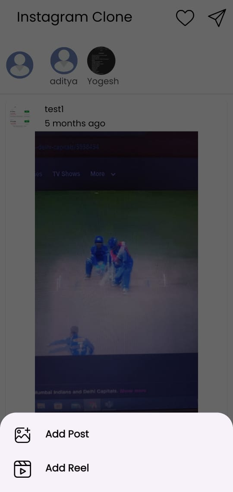
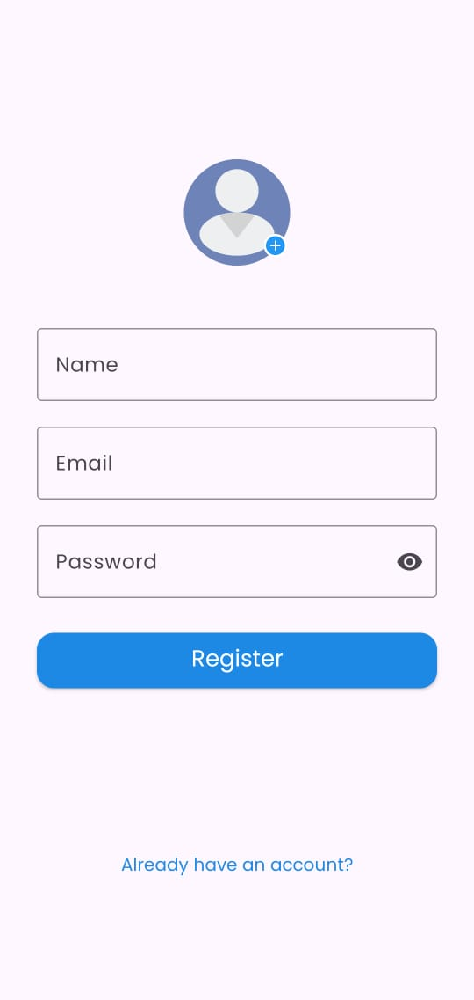
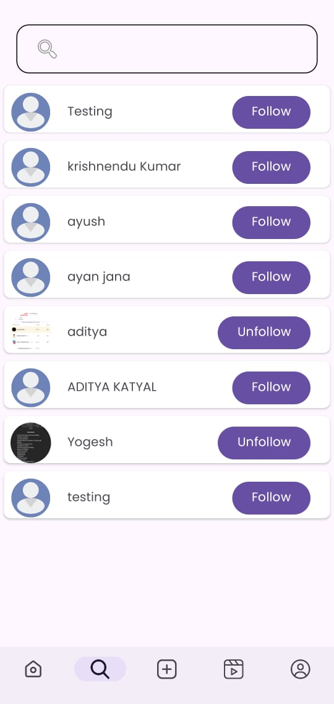

<h2>Designed and developed a feature-rich Instagram clone mobile application using Kotlin in Android Studio. Implemented functionalities including user authentication, posting images and reels, likes, follows, and more. Ensured intuitive UI/UX design and optimized performance for seamless user experience.</h2>

